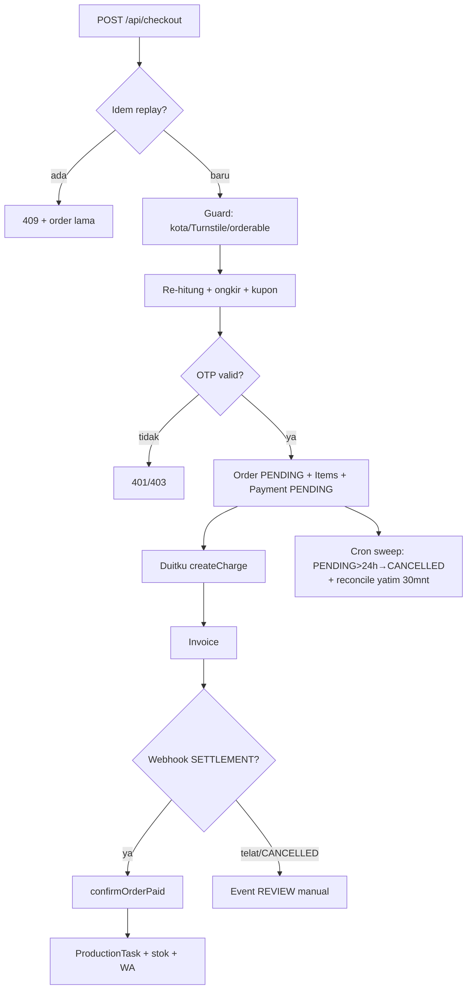

# ALUR LENGKAP KAOS KAMI — User, Admin, Program (+ Mobile APK)

> Disusun 14 Sep 2026 dari riset 4 agen paralel atas kode aktual.
> Cakupan: `kaos-kami-web` (Next 15 App Router) + `kaos-kami-mobile` (Capacitor 8).
> Konvensi: `web:` = `kaos-kami-web/src/`, `mob:` = `kaos-kami-mobile/src/`.

---

## 0. Peta Besar (satu gambar)

```mermaid
flowchart LR
    subgraph USER["ALUR USER (pembeli)"]
        A[Landing] --> B[Katalog / Kalkulator]
        B --> C[Studio 3D\n(desain + cm + DPI)]
        C --> D[Cart]
        D --> E[Checkout\nOTP + ongkir + kupon]
        E --> F[Duitku QRIS]
        F --> G[Invoice + Track]
    end
    subgraph SYS["ALUR PROGRAM (sistem)"]
        E --> H[POST /api/checkout]
        H --> F
        F --> I[Webhook Duitku]
        I --> J[confirmOrderPaid\nProductionTask + stok + WA]
        J --> K[Cron sweep/backup]
    end
    subgraph ADM["ALUR ADMIN (workshop)"]
        J --> L[Orders + Detail]
        L --> M[Production kanban]
        M --> N[Job-ticket / Gang-sheet]
        N --> O[Ship + Selesai]
    end
    G --> L
```

Status order (sumber `web:app/admin/orders/page.tsx:18-29`):

```
PENDING_PAYMENT → PAYMENT_CONFIRMED → IN_PRODUCTION_QUEUE → PRINTING
→ QUALITY_CHECK → READY_TO_SHIP → SHIPPED → DELIVERED → COMPLETED
   + CANCELLED / REFUNDED (cabang) + REVIEW:OVERSELL (flag)
```

---

## BAGIAN 1 — ALUR USER (Web)

### 1.1 Landing (`web:app/page.tsx`)

1. `page.tsx:7-10` — CanvasStage dimuat lazy client-only; `page.tsx:50-52` set `viewMode("story")`; tanpa WebGL → `StaticShowcase`.
2. `ui/HeroOverlay.tsx:18-34` — judul dari CMS R2 (cache `kaos-hero-cms`), SWR via sessionStorage + `min-h` anti-CLS.
3. `ui/HomeCatalogSection.tsx:40-52` — `GET /api/catalog/variants` ambil 3 item; gagal → tampil link katalog (tak bolong).

### 1.2 Katalog (`web:app/catalog/CatalogClient.tsx`)

1. Fetch variants; bedakan API-down vs stok kosong (`:56-72`).
2. Filter `ALL/READY_MADE/LIMITED_DROP` + size `S–XXL` (`:74-79`); **XXXL sengaja dihapus** → fail-closed ke XXL (`:178-196`).
3. Dua jalan: `+KERANJANG` (guard stok `<=0` → notice, `addItem` `:83-104`) atau `Buka di Studio` (alias `jacket↔shirt`, set apparel/warna/size `:106-129`).

### 1.3 Kalkulator sablon (`web:app/kalkulator-sablon/`)

Halaman statis SEO; `KalkulatorSablonClient` hitung tier cm → biaya + tabel GSM/placement (SSOT `printTiers/APP leveL_CATALOG`). Cocok → lanjut studio/katalog.

### 1.4 Studio 3D (`web:app/studio/StudioClient.tsx` + `components/3d/`)

1. Subscribe `useConfiguratorStore` (`:27-54`); header preset kamera DEPAN/BLKNG/KERAH/LNGN.
2. `CanvasStage.tsx:176-215` baca `activeApparel/color/materialFinish/partColors/modelMode` + `useDeviceTier` + fallback `contextLost` → tombol reload.
3. `CustomizerDrawer.tsx:398` — pilih apparel, warna, upload decal, teks, pattern, multi-part, finish, ukuran, qty.
4. State: `store/useConfiguratorStore.ts:31-56` (`activeApparel/selectedColor/selectedSize/decals/partColors`); `addDecal/updateDecal` (`:322-336`).
5. **Kalibrasi fisik** `lib/scaleCalibration.ts`: max depan **30,0 cm** (`:428-434`), scale-fit proporsional (`:444-455`), `offsetFromCollarCm` (`:458-472`), guard `fitsBox/isWithinProductionLimits` (`:474-482`). Over-30cm di-fit paksa (min 3,5 cm).
6. **DPI** `lib/dpiAnalyzer.ts:24-59`: `DPI = min(px/cm per sumbu)`; `≥300 EXCELLENT`, `0 = POOR`. DPI buruk tetap bisa checkout (hasil blur — risiko pembeli).

### 1.5 Cart (`store/useCartStore.ts` + `ui/CartDrawer.tsx`)

1. Item dikunci `id+size`, qty di-cap stok (`capFor`), `sanitizeDecals` max 10 + URL ≤500KB (`:34-97,161-217`).
2. `syncPrices(map)` anti harga basi (`:222-253`); persist lokal (`:274-286`).
3. Drawer tampilkan `priceNotice` saat dibuka; buka CheckoutModal `mode=cart` (`CartDrawer.tsx:13-31`).

### 1.6 Checkout (`ui/CheckoutModal.tsx` → `POST /api/checkout`)

**Di client (`CheckoutModal.tsx`):**

| Langkah | File | Isi |
|---|---|---|
| Mode | `:58-89` | `custom-3d` vs `cart` |
| Form | `:106-154` | nama, WA (`normalizePhoneId` min 9 digit), email regex, alamat (wajib kecuali PICKUP), kecamatan, `deliveryMethod` |
| Ongkir | `:106-154` | `PICKUP` Rp0 • `FREE_MAKASSAR` Rp0 (wajib district whitelist, else 400) • `EXPEDITION_MANUAL` (quote live wajib, tanpa silent-fallback) |
| Kupon | `:106-154` | kode opsional, validasi server |
| Anti-basi | `:484-506` | `fetchServerPriceMap + syncPrices`; beda → batal, wajib klik BAYAR ulang |
| Master aset | `:540-620` | upload base64 → URL https R2 (best-effort) |
| OTP | `:219-256` | `POST /api/auth/send-otp` (mock hanya dev); verify lokal format, **verifikasi asli di server saat BAYAR** |
| Bayar | `:622-687` | `POST /api/checkout` + header `Idempotency-Key` (UUID per klik `:48-56`) → `duitkuPay: checkout.process(ref, {success→/orders/id, pending, error, close→invoice})`, fallback `paymentUrl` |

**Di server (`app/api/checkout/route.ts:100-824`):** detail penuh di Bagian 3.1. Ringkas: rate-limit 5/mnt → replay idem → assert Duitku → Zod 2MB → guard kota → Turnstile fail-closed → tolak non-orderable → re-hitung harga server → ongkir → kupon → **gerbang OTP** → klaim idem → consume kupon → user → address → Order `PENDING_PAYMENT` → seal idem → items + desain `ORDERED` + arsip R2 → Payment `PENDING` → `createCharge` → WA fire-and-forget.

**Error yang bisa diterima pembeli:** `401` OTP salah/kadaluarsa • `403` owner-mismatch/Turnstile • `409` double-klik (idem) atau link kadaluarsa • `400` validasi/kupon/ongkir • `413` >2MB • `502/503` Duitku down.

### 1.7 Bayar — Duitku (`lib/payments/duitku.ts:44-176`)

`createCharge`: `returnUrl=/orders/<id>`, `callback=/api/webhooks/duitku`, expiry 1440 mnt, signature MD5/HMAC. Pop diblokir → redirect `paymentUrl`; pop ditutup → tetap ke invoice (cart dipertahankan; clear hanya saat confirmed).

### 1.8 Invoice (`app/orders/[id]/page.tsx`)

1. Query order+items+payment (`:39-50`); anti-IDOR: PII di-mask (`:56-67`); `isPaid` dari status server (query `?status` bisa palsu — diabaikan `:72-73`).
2. Tombol `wa.me` konfirmasi + minta link bayar (`:76-93`).
3. `RepayButton.tsx:66-97` — `POST /api/orders/[id]/repay` + OTP pemilik; `409` link masih berlaku; `403` OTP orang lain; lunas → reload.
4. `CancelOrderButton.tsx:14-32` — pemilik login, hanya `PENDING`, kupon hangus.

### 1.9 Track + Dashboard + Legal

* `TrackClient.tsx:52-112` — kirim OTP WA (5 mnt, resend lock), cek 6-digit → `POST /api/track/orders` → link invoice (`:173`).
* `dashboard/orders/page.tsx:39-59` — tamu → `/track`; user lihat 5 order + 6 desain + AddressBook/Reorder.
* `kredit/page.tsx:86-98` — atribusi CC-BY-4.0/CC0; `privacy/page.tsx:27-54` — data WA/alamat/desain, Duitku tak simpan kartu, Turso+R2.

---

## BAGIAN 2 — ALUR ADMIN (Workshop)

### 2.1 Login & peran

* `admin/layout.tsx:20-29` — `getSession` → role wajib `ADMIN / SUPER_ADMIN / PRODUCTION_STAFF`, else redirect `/` (fail-closed).
* API guard `lib/security/authGuard.ts:36-69` — `assertRole()`; `PRODUCTION_STAFF` **sengaja dikeluarkan** dari aksi finansial.
* Pembagian: operator (`PRODUCTION_STAFF`) = kanban, resi, gang, job-ticket. Finansial (cancel/refund/katalog/kupon/zona/CMS) = `ADMIN/SUPER_ADMIN` only.

### 2.2 Dashboard (`admin/page.tsx:20-44,162-193`)

Omset = hanya lunas (`NOT IN (PENDING_PAYMENT, CANCELLED, REFUNDED)`); antrean `DESIGN_PREP..QUALITY_CHECK`; flag `EXPRESS`; 6 order terbaru link detail.

### 2.3 Orders (`admin/orders/`)

1. List: 25/hal, filter `q=orderNumber` + status enum, WA di-mask (`orders/page.tsx:14-56,130-170`).
2. Detail `[id]` (`:29-41,199-381`): join items+design+tasks+user+address+payment+history, inspector 3D, **dimensi fisik per-task** (`printWidthCm/HeightCm/offsetFromCollarCm`), download `rawAssetUrl` R2, timeline audit, mapping bayar.
3. Aksi (`OrderAdminActions.tsx:19-73` → `PATCH /api/admin/orders/[id]`):
   * `trackingNumber` boleh staff (`:83-85`).
   * `cancel`/`refund` khusus ADMIN (`:56-59`); cancel hanya `PENDING_PAYMENT/PAYMENT_CONFIRMED` else 400 + race 409 (`:86-99`); refund hanya rantai lunas + `Payment→REFUNDED` + `restoreCoupon` best-effort (`:108-138`).

### 2.4 Repay mapping & oversell

* Satu-satunya pengesahan = `confirmOrderPaid()` (`lib/payments/confirmOrder.ts:15-50`): race-guard `PENDING_PAYMENT → PAYMENT_CONFIRMED`, spawn task, dipakai webhook + repay.
* Oversell: tetap lunas + note `REVIEW:OVERSELL` + marker + WA admin (`:180-239`) — dibawa ke triase manual, bukan dibatalkan diam-diam.

### 2.5 Production kanban (`admin/production/`)

1. `GET /api/admin/production-tasks` — staff hanya `assigned NULL/miliknya`, admin semua, limit 200 (`:19-56`).
2. `PATCH claim:true` hanya saat `IS NULL` else **409**; advance milik orang lain **403**; `DONE` final (`:108-143`).
3. Transisi otomatis: `PRINTING → Order PRINTING + WA`; `PACKAGING/DONE → READY_TO_SHIP (PICKUP) / SHIPPED + WA` (`:168-217`). UI drag `@dnd-kit` + claim (`production/page.tsx:159-241`).

### 2.6 Job-ticket & gang-sheet (cetak)

* Job-ticket (`orders/[id]/job-ticket/`): kop tiket + tabel per-task (sisi/dimensi/offset) + checklist oven/press + tanda tangan 3 operator + `PrintButton`. **Force-light by design** (kertas workshop).
* Gang-sheet per-order (`orders/[id]/gang-sheet/`): kanvas A3 `lebar 30cm` + `printFileUrl`.
* Builder global (`admin/gang-sheet/`): kolektor `TaskRow`, guard siap-cetak (file + dimensi valid `:86-114`), pack bin `1000×580mm` (`gangPacker.ts:31-33`), ekspor PNG DPI 300 (`gangExport.ts:63-322`), auto-download (`:356-388`).

### 2.7 Modul pendukung

| Modul | Alur | File |
|---|---|---|
| Catalog | Read-only by design: `PATCH` stok/harga/active khusus ADMIN; `POST/DELETE → 405` | `api/admin/catalog/route.ts:17-67`, `admin/catalog/page.tsx:29-104` |
| Assets | Render SSOT `assetManifest` (AKTIF/CADANGAN/STAGED/ARSIP, tris/byte, CC-BY) | `admin/assets/page.tsx:81-131` |
| Coupons | `GET` 200 + `DELETE`; `consume` atomik + `restore` clamp≥0 + marker `notes=COUPON:x` | `api/admin/coupons/route.ts`, `lib/coupons.ts:37-84` |
| Shipping | Zones CRUD + `usage`; quote live AgenWebsite → fallback zone | `admin/shipping/page.tsx`, `api/admin/zones/` |
| Customers | Paginated 25/hal + mask PDP + role select | `admin/customers/page.tsx:13-109` |
| Settings/CMS | Settings read-only (secret tak tampil) + template WA; CMS hero `POST` khusus ADMIN + arsip `hero-{stamp}.json` retensi 10 | `admin/settings/page.tsx`, `api/admin/cms/route.ts:14-81` |

---

## BAGIAN 3 — ALUR PROGRAM (Sistem / Backend)



### 3.1 `POST /api/checkout` (`app/api/checkout/route.ts`)

1. Rate-limit 5/mnt/IP (`:111-117`); replay `Verification(idem:checkout:*)` → 409 (`:132-162`).
2. Duitku belum config → 503 (`:165-173`); body >2MB → 413 (`:175-179`); Zod (`:186-209`).
3. `FREE_MAKASSAR` wajib kecamatan whitelist (`:214-230`); Turnstile fail-closed, `TURNSTILE_ENFORCE=false` = bypass darurat (`:238-256`); tolak `orderable=false` (`:260-273`).
4. Harga server: varian DB (`:290-313`) atau `calculate6VariablePrice` 6-var (`:316-334`).
5. Ongkir (`:341-408`): live `awRatesCached(postal, max(250,qty*250))`; pilihan spesifik wajib match else 400; live down + pilihan eksplisit → 400; tanpa pilihan → fallback `resolveExpeditionCost` (zoneId → prefix → default → flat 25000). Berat ±250g/pcs.
6. Kupon read-only + total = sub − diskon + ongkir + surcharge, batas 10rb–500jt (`:413-432`).
7. **Gerbang OTP** setelah validasi murah, sebelum tulis (`:444-488`); `CHECKOUT_OTP_REQUIRED=false` = bypass darurat.
8. Klaim idem 10 mnt (`:494-506`); `consumeCoupon` atomik (`:512-524`); user anti-race `onConflictDoNothing` (`:526-546`); address (`:548-561`).
9. Order `PENDING_PAYMENT` nomor `KK-…` retry 5x (`:563-604`); seal idem 24 jam (`:607-615`).
10. Items + Design `ORDERED` + `archiveDecalsToR2` + kompensasi yatim (`:623-730`).
11. Payment `PENDING pending-<id>` **dulu** (`:740-748`); `createCharge` (`:771-782`); update `providerRef` (`:803-806`); WA fire-and-forget (`:814-824`).

### 3.2 Webhook + `confirmOrderPaid`

* `webhooks/duitku/route.ts`: rate 30/mnt (`:15-18`); MD5+HMAC (`:66-76`); tolak merchant asing (`:79-83`); amount wajib `== totalIdr` (`:101-104`); duplikat → sukses tanpa tulis (`:107-113`); non-PENDING (mis. CANCELLED sweep) → Event REVIEW + ack 200 (`:120-128`); update Payment (`:131-140`) → `confirmOrderPaid` (`:145`).
* `confirmOrder.ts:15-254`: race-guard (`:26-31`) → Event `PAYMENT_CONFIRMED` → spawn **ProductionTask per-decal** (≤10, fallback 28,5×16 `:50-176`) → stok atomik (`:183-199`) → oversell REVIEW + WA admin (`:201-239`) → WA pelanggan (`:241-254`).

### 3.3 Repay / cancel / cron / backup / health

* Repay: hanya PENDING + OTP pemilik; `00` + nominal cocok → lunas; `01` → 409 reuse link (`repay/route.ts:30-221`).
* Cancel: owner/admin, race → CANCELLED + `restoreCoupon` (`cancel/route.ts:17-59`).
* Sweep (`cron/sweep`, via cron-job.org + `Bearer CRON_SECRET`): PENDING >24h → CANCELLED + restore (`:35-66`); yatim >30 mnt tanpa Payment → `checkTransactionStatus` → insert + confirm (`:73-150`); marker `cron-state/sweep.json`.
* Backup: dump Turso → R2 privat, tolak >25MB (`backup/route.ts:32-66`); status publik nama/umur saja.
* Health: DB read-only + KV + R2 HEAD + umur marker cron; 503 hanya bila DB mati (`health/route.ts:20-112`).

### 3.4 Quote / auth / aset

* Quote (`shipping/quote`): rate 20/mnt; live `awRatesCached` (cache 30 mnt, 429 → fallback) else `quoteZones` (`agenwebsite.ts:38-175`).
* Auth: `send-otp` (rate, hash, 5 mnt, Fonnte/mock) → `verify-otp` (brute-force guard, satu-pakai); better-auth drizzle User/Session (`lib/auth.ts:12-60`, sesi 30 hari).
* Upload R2: login + MIME + magic-byte + 10MB + kuota 50 file/200MB/hari (`upload/r2/route.ts:19-117`).
* Desain: `autosave` (guest ack, login upsert DRAFT); mobile sync LWW ≤50 (`mobile/designs/sync`).

### 3.5 Database (Turso, Drizzle `lib/drizzle-schema.ts`)

`User(38)` 1-N `Order(308)` / `Address(114)` / `Design(250)` / `Cart(285)`; `Order` 1-N `OrderItem(333)` + `OrderStatusEvent(347)` + `ProductionTask(382)`; 1-1 `Payment(360, orderId UNIQUE)`; `ProductVariant(159)` N-1 `ApparelCategory(138)`; `ExpeditionZone(223)` standalone; `Coupon(417)` via `notes=COUPON:x`; `Verification(98)` ganda OTP + idem; `UserDevice` (push). Runtime WAJIB Drizzle + `@libsql/client/web` (`lib/db.ts:43-51`); tanpa `db.transaction()` (kompensasi + sweep sebagai gantinya).

---

## BAGIAN 4 — ALUR MOBILE APK (Capacitor)

### 4.1 Navigasi

`TabBar.tsx:16-55` 5 tab (Home/Studio/Katalog/Pesanan/Profil) + state `activeTab` (`page.tsx:100-101`) + badge orders + `haptic.selection()`.

### 4.2 Studio mobile

`CanvasStageMobile.tsx:63-188` (tier + `transientMotion` 800ms + `demand/always`); tier high/mid/low/no-webgl (`useMobileDeviceTier.ts:22-114`); preload aktif + tetangga idle (`:99-141`); gizmo 1-jari geser + snap, 2-jari cubit (`DecalGizmoMobile.tsx:54-137`, batas `±0.35/MIN 0.02`); clamp **30,0 cm** + DPI (`useMobileStudioStore.ts:111-258`); upload `optimizeDecalImageForMobile`.

### 4.3 Katalog + CheckoutSheet

Katalog ETag/304 + guard `orderable/mockup` (`page.tsx`); `BottomSheet.tsx:17-59`. `CheckoutSheet.tsx` 3 langkah: L1 alamat + GPS + whitelist kecamatan (`:78-185`); L2 kurir + `quoteShipping` + blokir tanpa quote (`:126-240`); L3 OTP + QRIS (`:82-245`). Submit: kompres + `createDesignDraft` (R2 dulu, fallback base64 `:280-352`) → `checkout(payload, {idempotencyKey})` (`:353-397`) → sukses `clearCart + Duitku modal`; 502/409 pakai `orderId/invoiceUrl` (`:399-440`).

### 4.4 Client API (`mob:lib/api/mobileApiClient.ts`)

`getCatalog` 304 (`:67-86`) • `checkout` Idempotency-Key (`:88-120`) • `sendOtp` (`:127-142`) • `pollOrderStatus` (`:144-155`) • `syncDesigns` (`:157-169`) • `registerPushToken` (`:171-183`) • `getProductionTasks/advanceProductionTask` (`:189-212`) • proxy `quoteShipping/reverseGeocode/searchLocations` (`:226-276`). Timeout 15s + retry exponential (jaringan saja; OTP tak di-retry).

### 4.5 Tracker / profil / admin / offline

* `UserOrderTracker` polling 10s, backoff 30/60s, pause saat hidden (`:245-305`).
* Profil: galeri desain tersimpan, OAuth `kaoskami://auth/callback`, biometrik + auto-lock background, Preferences native + cermin localStorage.
* Admin mobile: `AdminMobileDashboard` (live tasks, fallback demo, ACC 1-klik, kunci bila `!liveMode` `:117-214`); scanner MLKit QR/Code128.
* Offline `syncQueue.ts`: `SAVE_DESIGN/SUBMIT_ORDER` didukung; `SUBMIT_ORDER` bisa antre tanpa userId (tamu) + `Idempotency-Key = m.id`; MAX 50 + poison-eviction.
* Share/export/AR/push/deep-link: `share.ts` (Capacitor → `navigator.share` → clipboard); `exportStudio.ts` (HD + turntable); AR pose + KeepAwake hanya AR; push tap → tab Pesanan; deep-link allowlist `studio|auth/callback|payment` + `resultCode 00`; config `id.makassar.kaoskami / https / kaoskami.biz.id`.

### 4.6 Endpoint yang dipakai APK (di web)

`/api/mobile/catalog` • `/api/mobile/orders/checkout` • `/api/mobile/orders/[id]/status` • `/api/mobile/designs/sync` • `/api/mobile/notifications/register` + pinjam web: `auth/send-otp`, `shipping/quote|locations`, `geocode/reverse`, `designs`, `admin/production-tasks`.

### 4.7 Beda APK vs web

APK: ETag/304, guest-checkout, return deeplink + In-App Browser, `CapacitorHttp`, tier/DPR/demand, offline-queue, push, biometrik, GPS. Web: `CheckoutModal`, Fabric/Drei penuh, Turnstile, cookie sesi langsung.

---

## Lampiran — Kill-switch & fail-safe (operator wajib tahu)

* `CHECKOUT_OTP_REQUIRED=false` / `TURNSTILE_ENFORCE=false` = bypass darurat; hanya string persis `"false"` (unset = wajib). Default fail-closed (`RUNBOOK §2b`).
* Fonnte WA selalu try/catch + tombol `wa.me` manual — checkout 100% sukses walau WA mati.
* `DEPLOY/PUSH GATE`: tanpa perintah owner — jangan `git push` / deploy Cloudflare.
