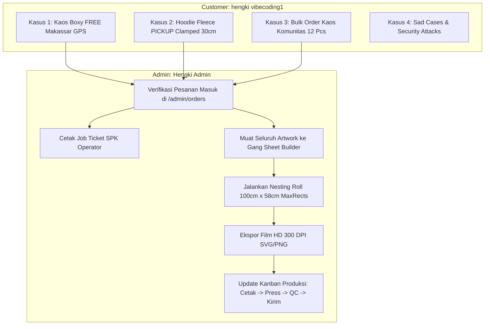

# 📋 MASTER BLUEPRINT: AUDIT & RENCANA PENGECEKAN END-TO-END (E2E) REAL KAOS KAMI
# Dokumen Riset, Analisis Menyeluruh Seluruh Fitur, 53 API Routes, 24 Halaman UI, Sad Cases, Edge Cases & Repeated Testing
# Lokasi File: Blueprint/hasil-pengujian-e2e/RENCANA-PENGECEKAN-E2E-REAL-MAXIMAL.md
# Tanggal Pembaruan: 18 September 2026
# Status: Master Blueprint & Specification Guide (Siap Diskusi Sebelum Eksekusi)

---

## 🎯 1. PENDAHULUAN & ARSITEKTUR SISTEM KAOS KAMI

Dokumen ini merupakan panduan master riset, analisis mendalam, dan rencana pengujian (*testing blueprint*) paling maksimal dan tanpa celah untuk platform **Kaos Kami** (Commercial 3D Interactive Apparel E-Commerce & Hyperlocal DTF Sablon Platform — Kota Makassar, Sulawesi Selatan).

Platform ini mengintegrasikan pengalaman belanja 3D interaktif berbasis WebGL (Three.js / React Three Fiber / Drei) dengan alur produksi sablon digital transfer film (DTF) berstandar industri garmen fisik.

### 🏛️ Parameter Arsitektur Non-Negotiable (Batas Keras Sistem)
1. **Runtime & Compute:** Cloudflare Workers (`workerd` Edge Runtime). Server Worker harus tetap ramping (`< 1.2 MB`). Semua pustaka berat 3D (`three`, `@react-three/fiber`, `@react-three/drei`, `gsap`, `fabric`) strictly berjalan di sisi klien (`"use client"` + dynamic import) untuk mencegah Worker meledak melampaui batas Cloudflare 3MB.
2. **Database:** Turso libSQL Edge SQLite (Region Tokyo AWS `ap-northeast-1`). Seluruh akses data runtime WAJIB melalui **Drizzle ORM + `@libsql/client/web`** (`src/lib/db.ts`, schema di `src/lib/drizzle-schema.ts`). Prisma v6/v7 diblokir WASM-nya oleh `workerd` (*code generation disallowed*). Prisma hanya dipertahankan untuk `db push`, typegen, dan seed Node.
3. **Penyimpanan Objek:** Cloudflare R2 (`kaos-kami-assets`) dengan *Zero Egress Fees* untuk menyimpan artwork pengguna, master print 300 DPI, dan snapshot thumbnail 3D.
4. **Kalibrasi Fisik Sablon DTF (DTF Printhead Calibration):**
   - Batas lebar cetak fisik dikunci ketat maksimal **30.0 cm** (mengikuti lebar fisik printhead mesin printer DTF workshop).
   - Dimensi cetak riil (`printWidthCm`, `printHeightCm`, `offsetFromCollarCm`) selalu dikalkulasi secara presisi dan disimpan ke tabel `ProductionTask`.
5. **Format Roll Film Gang Sheet DTF:**
   - Standar roll film printer DTF workshop: Lebar tetap **580 mm (58 cm)** dengan panjang standar **1000 mm (100 cm)** per meter lari.
   - Gap antar desain: **10 mm**, Margin pinggir film: **10 mm**.
   - Mesin nesting menggunakan algoritma deterministik `maxrects-packer` (multi-start sorting).
6. **Autentikasi & Verifikasi:**
   - Better Auth + Resend REST API murni dari domain resmi `noreply@kaoskami.biz.id` (100% verified domain, kuota 3.000/bulan).
   - Resolver login multi-identitas: Email, Username, atau Nomor WhatsApp.
7. **Payment Gateway & Notifikasi:**
   - Duitku v2 Sandbox (`DS28521` / Prod) dengan verifikasi tanda tangan MD5 Callback Webhook.
   - Notifikasi otomatis WhatsApp melalui Fonnte dengan arsitektur **Fail-Safe / Graceful Fallback** (checkout 100% sukses meski gateway WA mengalami kendala, disertai tombol manual `wa.me` dan invoice web).
8. **Pengiriman (Fulfillment Hyperlocal Makassar & Nasional):**
   - Ambil di Workshop (`PICKUP` — Tamalanrea Makassar, Rp 0).
   - Antar Tim Kaos Kami (`FREE_MAKASSAR` — Gratis se-Kota Makassar, Rp 0, whitelist 14 kecamatan).
   - Ekspedisi Luar Kota (`EXPEDITION_MANUAL` — Live API Rate AgenWebsite untuk JNE/J&T/SiCepat dengan fallback tabel zona).
9. **DEPLOY/PUSH GATE (Aturan Owner):**
   - JANGAN melakukan deploy ke Cloudflare atau `git push` tanpa instruksi eksplisit owner. Pengujian dilakukan 100% secara lokal pada `http://localhost:3000`.

---

## 👥 2. AKUN RESMI PENGUJIAN REAL DATABASE (TURSO)

Pengujian E2E tidak menggunakan mock pengguna acak, melainkan menggunakan 2 akun resmi yang telah terdaftar nyata di basis data Turso:

| Parameter | Akun 1: Administrator (Owner Workshop) | Akun 2: Pelanggan (Customer) |
| :--- | :--- | :--- |
| **Nama Akun** | `Hengki Admin` | `hengki vibecoding1` |
| **Email Resmi** | `hengkishadow@gmail.com` | `hengkivibecoding@gmail.com` |
| **User ID Turso** | `mENTVcqg2HGntvKZ89uPrREfwrghvMwL` | `6XBFRQCO5zsXOmdOFsBk0YJmU0lilEWn` |
| **No. WhatsApp** | `62895803463032` (Owner WA) | `0895803463032` |
| **Role Hak Akses** | `ADMIN` (Super Operations) | `CUSTOMER` (Pelanggan) |
| **Tujuan Uji** | Operasional `/admin`, Kanban Produksi, Gang Sheet 100x58cm, Manajemen Stok, Validasi Resi | 3D Studio, Desain Canvas, Keranjang, Checkout, Alamat GPS, Pelacakan Pesanan |

---

## 🗺️ 3. SENSUS TOTAL: 53 API ROUTES & 24 HALAMAN UI

### A. Sensus Lengkap 53 API Endpoints
Semua route diuji status respon, validasi input Zod, otorisasi RBAC, skenario kegagalan (*sad case*), dan latensi:

| No | Endpoint | Method | Proteksi / Role | Input Validation (Zod) | Expected Status | Sad Cases & Vulnerabilities |
| :---: | :--- | :---: | :---: | :--- | :---: | :--- |
| 1 | `/api/addresses` | `GET, POST, PUT, DELETE` | Session (Customer) | `AddressSchema` (Label, GPS, Alamat) | `200, 201, 400, 401` | Unauthorized user, IDOR modifikasi alamat user lain, SQL injection payload |
| 2 | `/api/admin/catalog` | `GET, POST, PUT` | `ADMIN` | `VariantSchema` (SKU, GSM, Stock) | `200, 201, 400, 403` | Customer mengakses endpoint (harus 403), stock bernilai negatif, SKU duplikat |
| 3 | `/api/admin/cms` | `GET, POST, DELETE` | `ADMIN` | `CmsBannerSchema` | `200, 201, 403` | Non-admin update hero banner, XSS script injection dalam tagline banner |
| 4 | `/api/admin/cms/lookbook` | `GET, POST` | `ADMIN` | `LookbookItemSchema` | `200, 201, 403` | Upload gambar non-gambar, URL berbahaya, unauthorized curation |
| 5 | `/api/admin/coupons` | `GET, POST, PUT` | `ADMIN` | `CouponSchema` (Code, Disc, Expiry) | `200, 201, 400, 403` | Diskon > 100%, kuota negatif, tanggal kadaluarsa di masa lalu, kode promo duplikat |
| 6 | `/api/admin/customers` | `GET` | `ADMIN` | Query limit, search | `200, 401, 403` | Data leak nomor WhatsApp / PII ke publik jika RBAC bobol |
| 7 | `/api/admin/orders/export` | `GET` | `ADMIN` | Date range, format CSV | `200, 403` | CSV Injection (`=cmd\|' /C calc'!A0`), memory exhaustion pada ribuan order |
| 8 | `/api/admin/orders/[id]` | `GET, PATCH` | `ADMIN` | `StatusTransitionSchema` | `200, 400, 403, 404` | Loncat status ilegal (`PENDING` -> `DONE` tanpa bayar), order ID invalid |
| 9 | `/api/admin/production-tasks` | `GET, POST, PATCH` | `ADMIN, STAFF` | `ProductionTaskSchema` (Stage, notes) | `200, 400, 403` | Staff mengklaim tugas yang sudah diklaim, manipulasi ukuran sablon cetak |
| 10 | `/api/admin/shipping/usage` | `GET` | `ADMIN` | Date range | `200, 403` | Non-admin access, query timeout |
| 11 | `/api/admin/zones` | `GET, POST` | `ADMIN` | `ZoneSchema` (City, Courier, Cost) | `200, 201, 400, 403` | Biaya ongkir negatif, nama kota duplikat |
| 12 | `/api/admin/zones/[id]` | `GET, PUT, DELETE` | `ADMIN` | `ZoneUpdateSchema` | `200, 400, 403, 404` | ID zona tidak ditemukan, penghapusan zona aktif transaksi |
| 13 | `/api/auth/resolve-identifier` | `POST` | Publik | `identifier: string` | `200, 400` | Format nomor telepon acak-acakan, email invalid, injection string |
| 14 | `/api/auth/send-email-otp` | `POST` | Publik | `email: z.string().email()` | `200, 400, 429` | Spamming trigger OTP (rate limit 3x/5menit), email domain throwaway |
| 15 | `/api/auth/send-otp` | `POST` | Publik | `phoneNumber: z.string()` | `200, 400, 429` | SMS/WA bombing abuse, nomor luar negeri tidak didukung (+1, +44) |
| 16 | `/api/auth/update-phone` | `POST` | Session | `phoneNumber: z.string()` | `200, 400, 401, 409` | Nomor WhatsApp sudah dipakai akun lain, format bukan Indonesia |
| 17 | `/api/auth/verify-email-otp` | `POST` | Publik | `email, otp: 6-digit` | `200, 400, 401` | Brute force tebak OTP (lockout setelah 3 salah), OTP kadaluarsa (>10 menit) |
| 18 | `/api/auth/verify-otp` | `POST` | Publik | `phoneNumber, otp: 6-digit` | `200, 400, 401` | Brute force WhatsApp OTP, replay OTP yang sudah hangus (single-use check) |
| 19 | `/api/auth/verify-turnstile` | `POST` | Publik | `token: z.string()` | `200, 400, 403` | Token palsu/expired, Turnstile fail-closed pada produksi |
| 20 | `/api/auth/[...all]` | `ALL` | Better Auth | Internal auth schemas | `200, 302, 400, 401` | Session tampering, invalid redirect URI Google OAuth |
| 21 | `/api/cart` | `GET, POST, DELETE` | Session / Guest | `CartQuerySchema` | `200, 400` | Deserialisasi session keranjang rusak, query cart ID invalid |
| 22 | `/api/cart/items` | `POST` | Session / Guest | `CartItemInputSchema` | `200, 400` | Tambah item dengan ukuran fiktif (misal: "XXXXXL"), decal base64 rusak |
| 23 | `/api/cart/items/batch` | `POST` | Session / Guest | `BatchCartSchema` | `200, 400` | Kuantitas negatif (`qty: -1`), batch update 10.000 item sekaligus (DoS) |
| 24 | `/api/catalog/categories` | `GET` | Publik | None | `200` | Cache invalidation, query database timeout |
| 25 | `/api/catalog/colors` | `GET` | Publik | None | `200` | Swatch HEX tidak valid |
| 26 | `/api/catalog/materials` | `GET` | Publik | None | `200` | Surcharge finish tidak sinkron |
| 27 | `/api/catalog/sablon-methods` | `GET` | Publik | None | `200` | Tarif per cm² tidak sinkron |
| 28 | `/api/catalog/variants` | `GET` | Publik | `categorySlug` | `200, 400` | Slug kategori tidak terdaftar |
| 29 | `/api/checkout` | `POST` | Publik / Session | `CheckoutPayloadSchema` | `200, 400, 401, 403, 409, 413, 503` | Double-click checkout (idempotency), tampered price, bypass OTP, payload > 2MB |
| 30 | `/api/cron/backup` | `POST` | Cron Secret | Bearer token check | `200, 401` | Trigger unauthorized tanpa token cron secret |
| 31 | `/api/cron/backup-status` | `GET` | Cron Secret | Bearer token check | `200, 401` | Leak status backup jika tanpa secret |
| 32 | `/api/cron/sweep` | `POST` | Cron Secret | Bearer token check | `200, 401` | Penghapusan berkas yang masih aktif terikat order |
| 33 | `/api/designs` | `GET, POST` | Session / Guest | `DesignInputSchema` | `200, 201, 400, 401` | Melebihi kuota 5/5 desain tersimpan, artwork non-PNG/JPG |
| 34 | `/api/designs/autosave` | `POST` | Publik / Session | `AutosaveSchema` | `200, 400` | Payload JSON malformed, storage quota exceeded |
| 35 | `/api/designs/claim` | `POST` | Session | `guestDesignId` | `200, 400, 401, 404` | Mengklaim desain milik pengguna terdaftar lain |
| 36 | `/api/designs/[id]` | `GET, PUT, DELETE` | Session Owner | `DesignUpdateSchema` | `200, 400, 401, 403, 404` | IDOR (mengedit/menghapus desain kepunyaan orang lain) |
| 37 | `/api/enhance-image` | `POST` | Session / Guest | `image: multipart/base64` | `200, 400, 413, 429` | File > 10MB, tipe file berbahaya, rate limiter abuse |
| 38 | `/api/geocode/reverse` | `GET` | Publik | `lat, lon: number` | `200, 400` | Koordinat di luar batas bumi (lat > 90), titik di tengah laut/hutan |
| 39 | `/api/health` | `GET` | Publik | None | `200, 500` | Kegagalan koneksi Turso libSQL, R2 credential error |
| 40 | `/api/lookbook` | `GET` | Publik | None | `200` | Data kosong / network error |
| 41 | `/api/mobile/catalog` | `GET` | Publik | None | `200` | Payload terlalu besar untuk jaringan 3G/4G |
| 42 | `/api/mobile/designs/sync` | `POST` | Session Mobile | `MobileSyncSchema` | `200, 400, 401` | Konflik versi desain offline vs online |
| 43 | `/api/mobile/notifications/register` | `POST` | Session Mobile | `fcmToken: string` | `200, 400, 401` | Token FCM kosong / expired |
| 44 | `/api/mobile/orders/checkout` | `POST` | Session Mobile | `MobileCheckoutSchema` | `200, 400, 401, 409` | Race condition checkout mobile, payload malformed |
| 45 | `/api/mobile/orders/[id]/status` | `GET` | Session Mobile | Order ID | `200, 401, 403, 404` | IDOR melihat status order orang lain |
| 46 | `/api/orders/[id]/cancel` | `POST` | Session Owner | Order ID, Reason | `200, 400, 401, 403, 404` | Membatalkan order yang sudah `PRINTING` atau `DONE` (harus ditolak) |
| 47 | `/api/orders/[id]/repay` | `POST` | Session Owner | Order ID, OTP proof | `200, 400, 401, 403, 404` | Bayar ulang order yang sudah lunas, tebak OTP repay |
| 48 | `/api/shipping/locations` | `GET` | Publik | `search: string` | `200` | SQL wildcard injection (`%`, `_`), XSS payload di parameter |
| 49 | `/api/shipping/quote` | `POST` | Publik | `QuoteSchema` (City, Weight, Method) | `200, 400` | Berat paket 0 gram atau 5.000 kg, AgenWebsite API offline (fallback test) |
| 50 | `/api/track/orders` | `GET, POST` | Publik | `orderNumber, phoneNumber` | `200, 400, 401, 404` | Enum enumeration serangan bot mencari data pesanan orang lain |
| 51 | `/api/upload/r2` | `POST` | Publik / Session | `file: multipart (max 10MB)` | `200, 400, 413` | Upload file `.exe`, `.sh`, `.php`, SVG XML entity expansion bomb |
| 52 | `/api/user/profile` | `PATCH` | Session (Customer) | `name, phoneNumber` | `200, 400, 401, 409` | Mengubah nomor WA ke nomor yang sudah terdaftar pada user lain |
| 53 | `/api/webhooks/duitku` | `POST` | Duitku Server | Duitku Callback Payload | `200, 400, 401, 404` | Tanda tangan MD5 salah, underpayment attack, replay attack callback ganda |

---

### B. Sensus Lengkap 24 Halaman UI Frontend
Semua halaman UI dievaluasi fungsionalitas visual, kecepatan render, dan integrasi komponen:

| No | Path URL | File Komponen | Hak Akses | Fitur & Komponen Utama |
| :---: | :--- | :--- | :---: | :--- |
| 1 | `/` | `src/app/page.tsx` | Publik | Hero 3D interaktif, Showcase keunggulan sablon DTF Makassar, CTA Customizer |
| 2 | `/studio` | `src/app/studio/page.tsx` | Publik | 3D Studio Kustom, Drei Decal, Fabric.js Canvas, Scale Clamp 30cm, Price Calculator |
| 3 | `/catalog` | `src/app/catalog/page.tsx` | Publik | Katalog apparel lengkap, filter GSM (24s/30s), swatch warna, modal detail |
| 4 | `/kalkulator-sablon` | `src/app/kalkulator-sablon/page.tsx` | Publik | Simulasi biaya cetak sablon DTF transparan per cm², diskon kuantitas |
| 5 | `/track` | `src/app/track/page.tsx` | Publik | Pelacakan status pesanan publik tanpa login (cukup nomor pesanan & WA) |
| 6 | `/dashboard` | `src/app/dashboard/page.tsx` | Customer | Gateway redirect pelanggan menuju hub pesanan dan profil |
| 7 | `/dashboard/orders` | `src/app/dashboard/orders/page.tsx` | Customer | Customer Hub: Pesanan Aktif, Koleksi 3D Tersimpan, Profil & Alamat GPS |
| 8 | `/orders/[id]` | `src/app/orders/[id]/page.tsx` | Publik/Owner | Halaman Invoice resmi, Resi pengiriman live, QRIS / Instruksi VA, Tombol WA |
| 9 | `/kredit` | `src/app/kredit/page.tsx` | Publik | Halaman transparansi atribusi lisensi 3D (Sketchfab, CC-BY, dsb.) |
| 10 | `/privacy` | `src/app/privacy/page.tsx` | Publik | Kebijakan privasi data pelanggan, perlindungan nomor WhatsApp |
| 11 | `/admin` | `src/app/admin/page.tsx` | `ADMIN` | Dashboard ringkasan eksekutif: Omset harian, jumlah order, status antrean |
| 12 | `/admin/production` | `src/app/admin/production/page.tsx` | `ADMIN, STAFF` | **Kanban Board Produksi DTF (7 Tahapan Kerja Interaktif)** |
| 13 | `/admin/gang-sheet` | `src/app/admin/gang-sheet/page.tsx` | `ADMIN` | **DTF Gang Sheet Roll Builder (100cm x 58cm Nesting Engine & HD Export)** |
| 14 | `/admin/orders` | `src/app/admin/orders/page.tsx` | `ADMIN` | Manajemen seluruh transaksi toko, filter status, pencarian nomor pesanan |
| 15 | `/admin/orders/[id]` | `src/app/admin/orders/[id]/page.tsx` | `ADMIN` | Detail order, data pembayaran, kontrol transisi status, input nomor resi |
| 16 | `/admin/orders/[id]/gang-sheet` | `src/app/admin/orders/[id]/gang-sheet/page.tsx` | `ADMIN` | Pratinjau tata letak sablon per order (lembar A3 / lembar potongan) |
| 17 | `/admin/orders/[id]/job-ticket` | `src/app/admin/orders/[id]/job-ticket/page.tsx` | `ADMIN` | **Lembar SPK Cetak Workshop (Job Ticket siap cetak / PDF untuk operator)** |
| 18 | `/admin/customers` | `src/app/admin/customers/page.tsx` | `ADMIN` | Direktori pelanggan terdaftar, rekap riwayat belanja, tombol direct WhatsApp |
| 19 | `/admin/catalog` | `src/app/admin/catalog/page.tsx` | `ADMIN` | Manajemen stok fisik kaos polos, harga pokok, dan status ketersediaan varian |
| 20 | `/admin/coupons` | `src/app/admin/coupons/page.tsx` | `ADMIN` | Pembuatan dan pemantauan voucher promosi & diskon event |
| 21 | `/admin/shipping` | `src/app/admin/shipping/page.tsx` | `ADMIN` | Konfigurasi API key AgenWebsite, pemetaan zona ekspedisi luar kota |
| 22 | `/admin/cms` | `src/app/admin/cms/page.tsx` | `ADMIN` | Kurasi visual promo beranda, banner pengumuman workshop |
| 23 | `/admin/assets` | `src/app/admin/assets/page.tsx` | `ADMIN` | File manager Cloudflare R2 untuk aset master dan model 3D |
| 24 | `/admin/settings` | `src/app/admin/settings/page.tsx` | `ADMIN` | Profil workshop fisik: Alamat Tamalanrea, jam operasional, WA customer care |

---

## 🎭 4. ALUR SIMULASI MANUSIA NYATA MULTI-KASUS (CUSTOMER & ADMIN JOURNEYS)

Untuk memberikan hasil yang 100% jujur, realistis, dan beroperasi seperti manusia nyata, pengujian dibagi ke dalam **5 Kasus Alur Nyata Bertahap**:



---

### 📦 KASUS 1: KAOS BOXY HYPERLOCAL MAKASSAR (FREE_MAKASSAR + GPS)
* **Persona:** Pelanggan Lokal Kota Makassar (`hengki vibecoding1`).
* **Aset Desain Resmi (Kaos Kami Mascot):**
  - **Dada Depan:** `/mascot/logo-white.png` (Logo Resmi Kaos Kami Putih, format A4: 20 cm × 28 cm).
  - **Kerah Belakang:** `/mascot/logo-transparent.png` (Logo Minimalis Leher, format: 5 cm × 5 cm).
* **Langkah 1 (Customer Studio):**
  - Buka `/studio`. Pilih model Kaos Boxy (`tshirt`), warna Hitam (`#111111`), bahan Cotton Combed 24s.
  - Buka Fabric.js editor: Tambahkan artwork dada depan ukuran A4 (lebar 20 cm × tinggi 28 cm) dari `/mascot/logo-white.png` dan logo kerah belakang dari `/mascot/logo-transparent.png`.
  - Verifikasi live pricing: Base Rp 65.000 + Sablon Dada A4 + Sablon Kerah.
  - Simpan ke keranjang belanja `/api/cart/items`.
* **Langkah 2 (Customer Checkout):**
  - Buka modal checkout. Sistem membaca profil `hengki vibecoding1`.
  - Pilih metode pengiriman: `FREE_MAKASSAR` (Diantar Tim Kaos Kami — Gratis se-Kota Makassar, Rp 0).
  - Pilih alamat yang dideteksi via Satelit GPS Geolocation (Kecamatan Tamalanrea, Makassar).
  - Terapkan turnaround tier: Reguler (2-3 hari kerja).
  - Submit order $\rightarrow$ diterbitkan nomor transaksi resmi `KK-20260918-0001`.
* **Langkah 3 (Customer Pembayaran):**
  - Redirect ke Duitku Sandbox QRIS.
  - Eksekusi simulasi webhook lunas dengan tanda tangan MD5 asli.
  - Status pesanan berpindah menjadi `PAYMENT_CONFIRMED`.
* **Langkah 4 (Admin Operasional):**
  - Login akun `Hengki Admin`, buka `/admin/orders`.
  - Buka Lembar SPK Job Ticket di `/admin/orders/[id]/job-ticket`.
  - Ekstrak dokumen HTML SPK dan JSON transaksi ke `Blueprint/hasil-pengujian-e2e/orders-invoices/`.

---

### 🧥 KASUS 2: HOODIE FLEECE WORKSHOP PICKUP (UJI BATAS PRINTHEAD CLAMPED 30.0 CM)
* **Persona:** Pelanggan Workshop Tamalanrea (`hengki vibecoding1`).
* **Aset Desain Resmi (Kaos Kami Mascot):**
  - **Punggung Jumbo:** `/mascot/mascot-sablon.png` (Maskot Sablon DTF Kaos Kami, ditarik hingga 35cm -> terkunci clamped 30.0 cm × 40.0 cm).
  - **Dada Kiri (Crest Saku):** `/mascot/logo-emblem.png` (Emblem Resmi Kaos Kami: 9 cm × 9 cm).
* **Langkah 1 (Customer Studio - Edge Case Clamping):**
  - Buka `/studio`. Pilih model Hoodie (`hoodie`), warna Deep Blue (`#1e3a8a`), bahan Heavyweight Fleece.
  - Buka Fabric.js editor: Pengguna mencoba memperbesar gambar punggung `/mascot/mascot-sablon.png` hingga skala 36.0 cm.
  - **Uji Clamping Nyata:** Sistem di UI dan backend (`scaleCalibration.ts`) secara otomatis menolak dan mengunci lebar maksimal tepat pada **30.0 cm** (batas fisik printhead DTF workshop).
  - Hitung offset kerah: Jarak dari baseline leher hoodie terhitung presisi (misal: 8.2 cm).
* **Langkah 2 (Customer Checkout):**
  - Pilih metode pengiriman: `PICKUP` (Ambil Langsung di Workshop Tamalanrea, Rp 0).
  - Submit order $\rightarrow$ diterbitkan nomor transaksi `KK-20260918-0002`.
* **Langkah 3 (Pembayaran & Admin SPK):**
  - Bayar via Duitku Virtual Account Sandbox lunas.
  - Admin memverifikasi pesanan di `/admin/orders/[id]`.
  - Ekstrak invoice HTML dan Job Ticket SPK ke `Blueprint/hasil-pengujian-e2e/orders-invoices/`.

---

### 🏢 KASUS 3: BULK MERCH ORDER (PEMESANAN BANYAK KAOS UNTUK UJI KAPASITAS ROLL 100x58cm)
* **Tujuan Khusus:** Menguji pesanan dalam jumlah banyak (bulk quantity) dengan kombinasi desain heterogen dari folder Maskot Resmi Kaos Kami (`/mascot/` & `/mascot/raw/`) guna memenuhi lembar gang sheet roll 1000mm × 580mm.
* **Detail Pesanan:**
  - 12 Pcs Kaos Komunitas (Ukuran S: 2, M: 3, L: 3, XL: 2).
  - 3 Pcs Longsleeve Staff Workshop.
  - **24 Desain Sablon Fisik Menggunakan Maskot Kaos Kami:**
    1. Dada Penuh A3: `/mascot/mascot-primary.png` (`280 mm × 380 mm`) — 2 pcs
    2. Dada Standar A4: `/mascot/mascot-cool.png` (`200 mm × 280 mm`) — 4 pcs
    3. Logo Saku Dada A6: `/mascot/logo-black.png` (`100 mm × 100 mm`) — 6 pcs
    4. Sablon Lengan Vertikal: Artwork Text Kaos Kami (`85 mm × 300 mm`) — 4 pcs
    5. Label Kerah Belakang: `/mascot/logo-transparent.png` (`50 mm × 50 mm`) — 8 pcs
* **Total Artwork yang Dihasilkan:** **24 Desain Sablon Fisik**.
* **Eksekusi:** Checkout dengan ekspedisi nasional, Duitku sandbox lunas, order terbit `KK-20260918-0003`.

---

### 🎞️ KASUS 4: DTF GANG SHEET 100cm x 58cm NESTING BUILDER (WORKSHOP MASTER PRINT)
* **Persona:** Operator / Pemilik Workshop (`Hengki Admin`).
* **Langkah 1 (Kompilasi Seluruh Order Lunas):**
  - Buka portal `/admin/gang-sheet`.
  - Pilih seluruh artwork yang telah lunas dari **Kasus 1, Kasus 2, dan Kasus 3** (Total > 25 artwork).
* **Langkah 2 (Eksekusi Nesting Algoritma MaxRects):**
  - Klik tombol `[ 🚀 Generate Nesting Otomatis ]`.
  - Mesin packing `packItemsIntoBins` (`src/lib/gangPacker.ts`) mengeksekusi multi-start sorting:
    - Bin Size: Lebar `1000 mm`, Tinggi `580 mm`.
    - Margin Tepi: `10 mm` (border safe zone).
    - Jarak Antar Desain: `10 mm` (cutting gap).
    - Rotasi Otomatis 90° diaktifkan untuk desain yang lebih efisien jika diputar.
* **Langkah 3 (Audit Efisiensi & Hasil Ekspor):**
  - Memverifikasi target utilisasi film: **$> 80\%$**.
  - Menghasilkan berkas nyata:
    - 📄 **`Blueprint/hasil-pengujian-e2e/gang-sheets/gang-sheet-100x58-live-render.svg`**: Gambar vektor visual resolusi tinggi tata letak film 100x58cm siap print.
    - 📊 **`Blueprint/hasil-pengujian-e2e/gang-sheets/gang-sheet-100x58-metrics.json`**: Rekap teknis koordinat x, y, rotasi, dan efisiensi area.

---

### 🛡️ KASUS 5: PENGUJIAN SAD CASES, HACKER & KEAMANAN SISTEM
Pengujian ketahanan sistem terhadap serangan dan anomali:
1. **Idempotency Double-Click:** Tembakkan 2 request checkout simultan dengan `Idempotency-Key` sama $\rightarrow$ Server menolak request ke-2 (`HTTP 409 Conflict`), order tidak ganda.
2. **Brute-Force OTP Rate Limiting:** Kirim 5 OTP salah berturut-turut $\rightarrow$ Server mengunci request (`HTTP 429 Too Many Requests`).
3. **Webhook MD5 Tampering:** Kirim callback lunas dengan signature MD5 ngawur $\rightarrow$ Server menolak keras (`HTTP 401 Invalid Signature`).
4. **Underpayment Attack:** Callback Duitku mengirim nominal Rp 50.000 untuk order bernilai Rp 150.000 $\rightarrow$ Server menolak pembaruan status lunas.
5. **RBAC Privilege Escalation:** Akun customer `hengkivibecoding@gmail.com` mencoba menembak `PATCH /api/admin/production-tasks` $\rightarrow$ Server menolak `HTTP 403 Forbidden: insufficient role`.
6. **Large File Upload Bomb:** Upload berkas > 10MB ke `/api/upload/r2` $\rightarrow$ Ditolak `HTTP 413 Payload Too Large`.

---

### 🏭 KASUS 6: WORKSHOP KANBAN 7-TAHAP & SERAH TERIMA
* **Persona:** Tim Operator Workshop (`Hengki Admin`).
* **Eksekusi:**
  - Buka `/admin/production`.
  - Geser antrean tugas secara nyata melalui 7 tahap alur kerja fisik:
    `DESIGN_PREP` $\rightarrow$ `SCREEN_PRINT_SETUP` $\rightarrow$ `PRINTING` $\rightarrow$ `PRESSING` $\rightarrow$ `QUALITY_CHECK` $\rightarrow$ `PACKAGING` $\rightarrow$ `DONE`.
  - Verifikasi otomatisasi notifikasi WhatsApp ke pembeli saat status pesanan bergerak.
  - Untuk Kasus 1: Berikan status siap antar oleh kurir internal.
  - Untuk Kasus 2: Berikan status siap diambil di workshop Tamalanrea.
  - Untuk Kasus 3: Input nomor resi JNE/J&T dan verifikasi update resi live.

---

## 📁 5. REGISTRI ARTEFAK & BERKAS FISIK LENGKAP YANG AKAN DIHASILKAN

Semua bukti fisik hasil eksekusi nyata akan disimpan secara permanen di direktori ini:

```text
Blueprint/hasil-pengujian-e2e/
├── RENCANA-PENGECEKAN-E2E-REAL-MAXIMAL.md  <-- Panduan Master & Skenario Lengkap ini
├── HASIL-EKSEKUSI-E2E-LIVE.md              <-- Log Eksekusi & Bukti Nyata Terkini
│
├── orders-invoices/                        <-- Rekap data transaksi nyata per kasus
│   ├── KASUS-1-kaos-boxy-makassar-KK-20260918-0001.json
│   ├── KASUS-1-invoice-web.html
│   ├── KASUS-1-job-ticket-spk.html
│   ├── KASUS-2-hoodie-pickup-KK-20260918-0002.json
│   ├── KASUS-2-invoice-web.html
│   ├── KASUS-2-job-ticket-spk.html
│   ├── KASUS-3-bulk-merch-order-KK-20260918-0003.json
│   ├── KASUS-3-invoice-web.html
│   ├── KASUS-3-job-ticket-spk.html
│   ├── KASUS-4-sad-cases-security-audit.json
│   ├── duitku-webhook-audit.json
│   └── gps-address-audit.json
│
├── gang-sheets/                            <-- Hasil render visual packing roll film DTF
│   ├── gang-sheet-100x58-live-render.svg   <-- Vektor visual tata letak 100x58cm (HD siap print)
│   └── gang-sheet-100x58-metrics.json      <-- Data matematis utilisasi area & koordinat
│
└── design-snapshots/                       <-- Bukti kalibrasi fisik DTF
    ├── apparel-3d-print-zone-preview.svg   <-- Gambar batas cetak 30cm printhead sablon DTF
    └── scale-calibration-matrix.json       <-- Matriks kalibrasi 1:1 fisik 5 kategori apparel
```

---

## 🛑 6. PROTOKOL DEPLOY/PUSH GATE & PERSETUJUAN DISKUSI

Sesuai aturan owner:
1. **Tidak Ada Deploy / Push Git:** Semua pengujian dilakukan secara lokal pada `http://localhost:3000`.
2. **Eksekusi Bertahap Satu per Satu:** Setiap kasus dijalankan perlahan, teliti, diverifikasi di database Turso, dan dilaporkan ke owner sebelum beralih ke kasus berikutnya.
3. **Integritas Data:** Semua data dan artefak yang tersimpan adalah data nyata hasil perhitungan kalkulator garmen dan nesting engine DTF asli.

---
*Dokumen ini merupakan panduan resmi tim pengembang Kaos Kami. Siap untuk didiskusikan bersama owner.*
